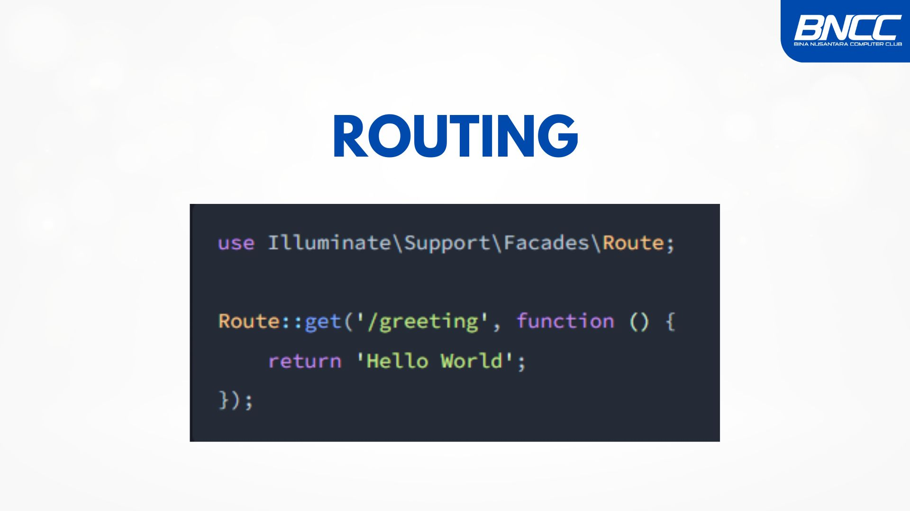
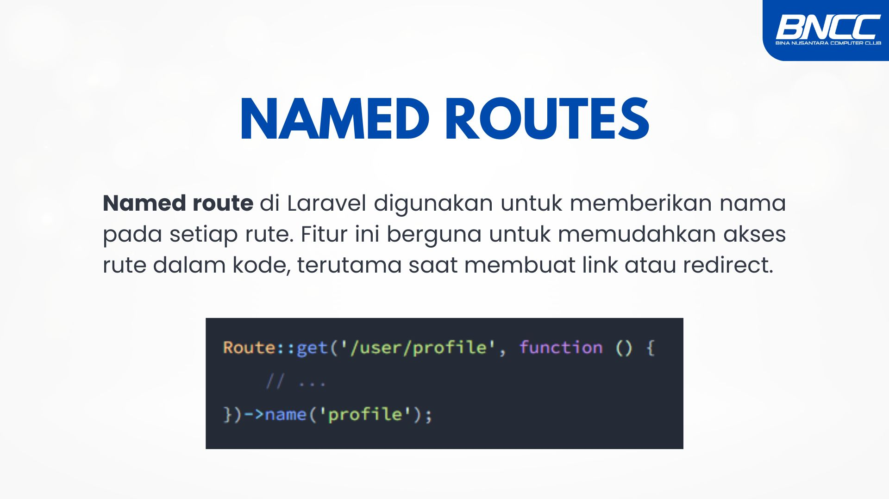
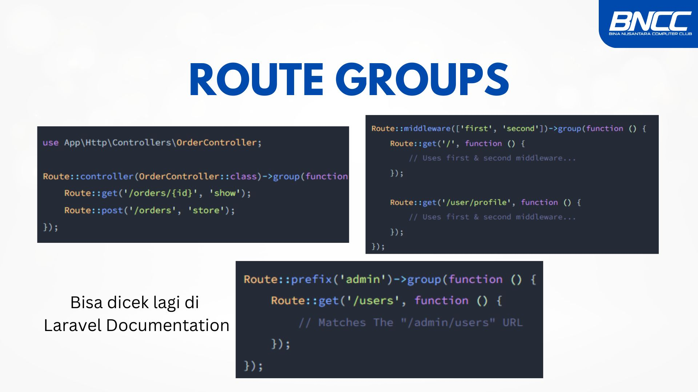

  

# 🧑‍💻 Pertemuan 9 — LNT Backend BNCC  

Welcome to **Pertemuan 9** of the LNT Backend BNCC class! In this session, we’re diving deep into **Laravel Routing** — an essential part of building powerful web applications. Let’s get started! 💻✨  

---

## 🎨 Link Canva (Slide Presentation)  
Here’s the Canva link to the slides we’ll be using in this session:  

```bash
https://www.canva.com/design/DAGfEYRoMbs/CiNZdGL7HEJTCjeigXRTKg/edit?utm_content=DAGfEYRoMbs&utm_campaign=designshare&utm_medium=link2&utm_source=sharebutton
```

---

## 🎯 Learning Outcomes  

By the end of this session, you’ll understand:  

- 🌐 **Routing in Laravel** — How to link URLs to specific logic in your app  
- 🛠️ **Routing Methods** — Different HTTP methods and their functions  
- 🏷️ **Named Routes** — Simplifying route access and navigation  
- 🧑‍🤝‍🧑 **Group Routing** — Organizing routes to avoid redundancy  

---

## 🛜 What is Routing?  

  

**Routing** is a mechanism in Laravel that connects URLs to specific logic or functions within your application. It’s responsible for handling all incoming requests and determining the appropriate response.  

In Laravel, routes are usually defined in the **`routes/`** folder. You can think of it as the map that guides how users interact with your web app! 🌐🗺️  

---

## ⚡ Routing Methods  

Laravel provides **6 core HTTP methods** for routing:  

| Method   | Description               | Use Case             |  
|----------|--------------------------|---------------------|  
| **GET**    | Retrieves data              | Accessing pages or data |  
| **POST**   | Adds new data               | Submitting forms       |  
| **PUT**    | Updates entire data         | Replacing records      |  
| **PATCH**  | Updates partial data        | Updating specific fields |  
| **DELETE** | Removes data               | Deleting records       |  
| **OPTION** | Checks available methods   | API communication      |  

Here’s an example:  

```php
use Illuminate\Support\Facades\Route;

Route::get('/home', function () {
    return view('home');
});

Route::post('/user', 'UserController@store');
Route::put('/user/{id}', 'UserController@update');
Route::delete('/user/{id}', 'UserController@destroy');
```

---

## 🏷️ Named Routes  

  

**Named Routes** in Laravel allow you to assign a name to a route, making it easier to reference in views, controllers, and redirects. It’s a great way to keep your code clean and readable!  

**Defining a Named Route:**  

```php
Route::get('/dashboard', 'DashboardController@index')->name('dashboard');
```

**Using a Named Route:**  

```php
// Redirecting
return redirect()->route('dashboard');

// Generating a URL
$url = route('dashboard');
```

---

## 🧑‍🤝‍🧑 Group Routes  

  

**Group Routes** help organize routes that share the same attributes — like middleware, prefixes, or namespaces. This reduces redundancy and keeps your route definitions tidy.  

**Example of Grouping Routes:**  

```php
Route::prefix('admin')->group(function () {
    Route::get('/dashboard', 'AdminController@dashboard');
    Route::get('/users', 'AdminController@users');
    Route::get('/settings', 'AdminController@settings');
});
```

In this example, all routes are automatically prefixed with `/admin`. Clean and simple! ✨  

---

## 💡 Let’s Build Together!  

That’s it for **Pertemuan 9**! We’ve covered the essentials of **Laravel Routing**, and I hope this material makes your backend development journey smoother. Don’t forget to practice — and if you hit any bumps, reach out! 🚀  

Happy coding, everyone! 💻💙  

---

**🧑‍🏫 Owen Limantoro**  
*LNT Backend Instructor | BNCC Praetorian*  
